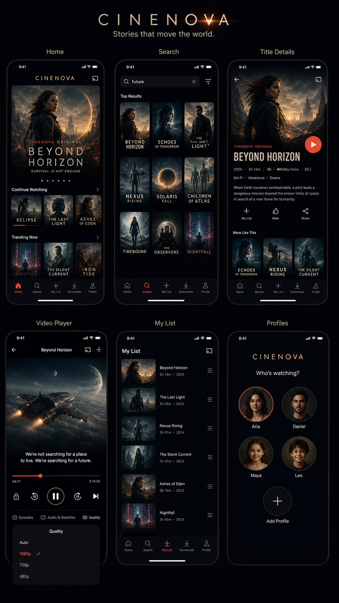
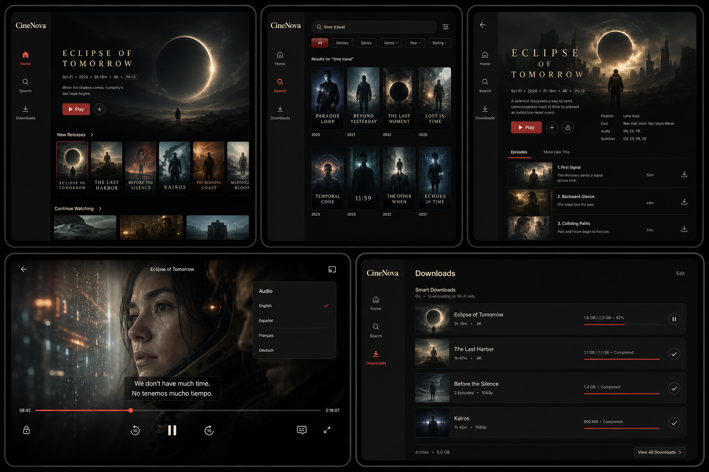
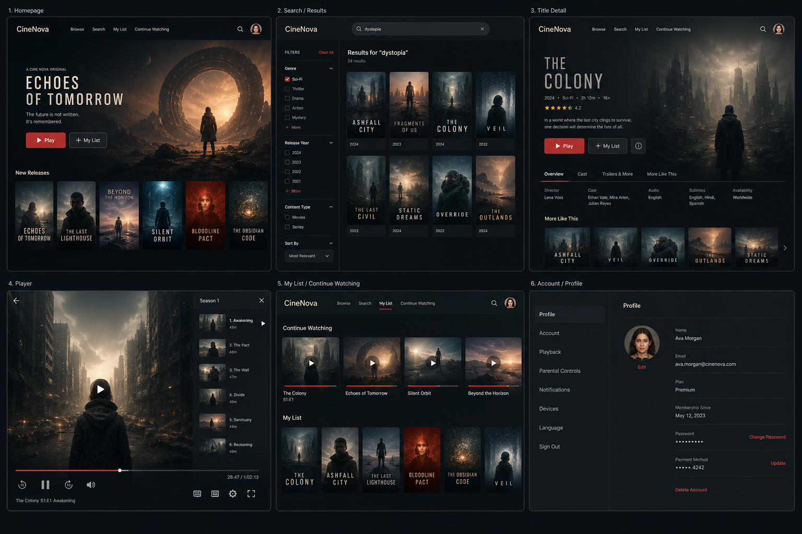
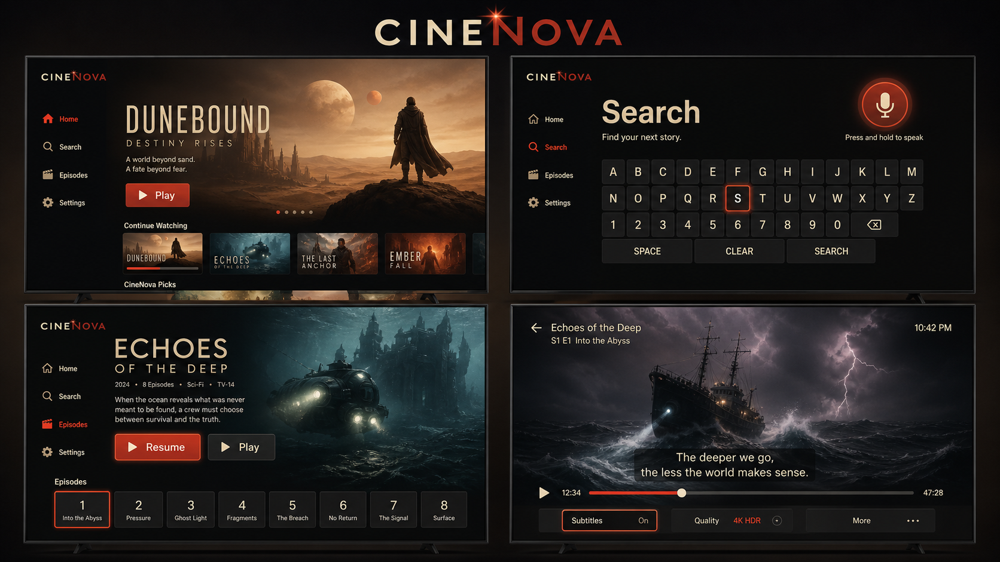
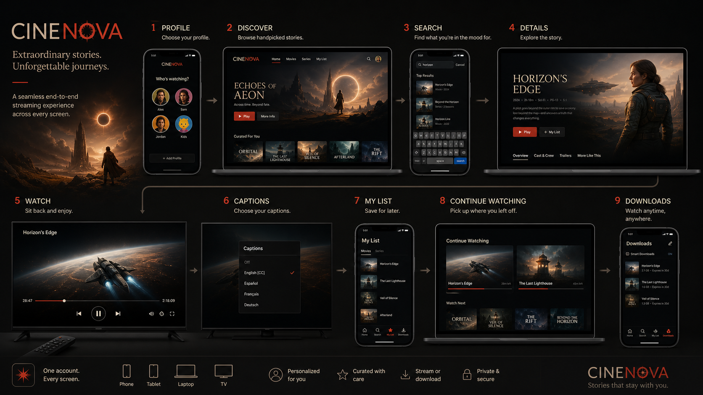

# CineNova — Visual Design Boards

**Direction:** Cinematic premium dark  
**Scope:** Core consumer experience  
**Delivery:** Responsive device storyboard set

These high-fidelity visual boards establish a cohesive product direction for the consumer application. All posters and media artwork are fictional, original placeholders for design exploration.

## Visual system

- **Atmosphere:** Deep charcoal/near-black surfaces, cinematic imagery, generous negative space.
- **Type:** Warm ivory, high-contrast sans-serif hierarchy; large type for TV “10-foot” viewing.
- **Accent:** Restrained amber-red for primary actions, active navigation, focus, and playback states.
- **Interaction:** Clear selected/focus states, especially on TV; large accessible touch targets on mobile/tablet.
- **Responsive behavior:** The navigation pattern shifts from mobile tabs to desktop top navigation and TV remote-oriented focus rails.

## Boards

### Mobile — core app screens
Home, search, title detail, player, My List, and profile selection.

### Tablet — lean-back browsing and downloads
Home, search/filter, details/episodes, player menus, and authorized downloads.

### Desktop / laptop — full web experience
Home, search, title detail, playback, My List/Continue Watching, and account/profile settings.

### Smart TV — 10-foot interface
Remote-friendly home browsing, on-screen search, title detail/episode selection, and player controls.

### Cross-device core user journey
Profile → discover → search → detail → watch → My List → authorized download state.

## Screen inventory for the next visual pass

The next set should generate **individual production-reference screens** (rather than multi-screen boards) for:

1. Welcome/onboarding and sign-in
2. Profile creation, selection, PIN lock, and child profile
3. Home, genre, collection, and editorial landing pages
4. Search default, suggestions, filters, no results, and results
5. Movie detail, series detail, season/episode, trailer, unavailable/right-restricted states
6. Player normal, captions, audio track, quality, next episode, playback error, PiP
7. Continue Watching, My List, history, ratings/reviews
8. Authorized downloads, expired download, limit reached, and device management
9. Subscription plans, checkout, billing, and payment-failure recovery
10. Account, security, notification preferences, language, theme, and privacy/export/delete-data
11. Support, status, legal/copyright report, and content-reporting flows

## Design-to-build note
Use these boards as a visual north star, not as the final implementation source of truth. Production implementation must use the CineNova design tokens, WCAG 2.2 AA checks, component states, responsive specifications, and rights-gated playback/download rules in the engineering specification.
